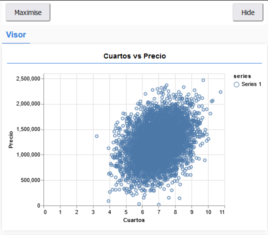
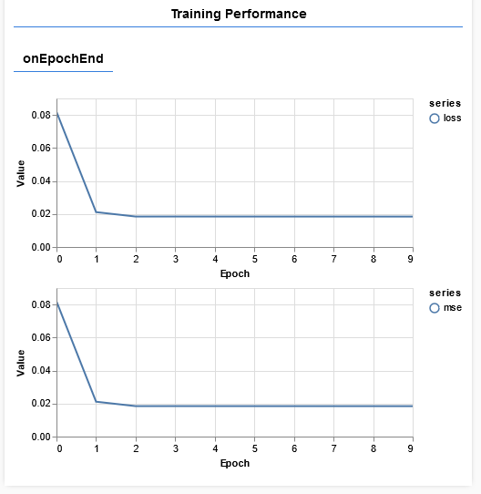

Realizaremos el entrenamiento de regresion lineal el cual genera los datos en puntos y genera una predicción la cual nos regresa un resultado más concreto al evaluar y genera valores entre cero y uno.

Con este modelo podemos predicir diferentes tipos de situaciones como por ejemplo predecir el valor estimado de una casa dependiendo de su locación el tamaño el número de habitaciones.

Entrenaremos nuestra red neuronal durante 50 épocas

